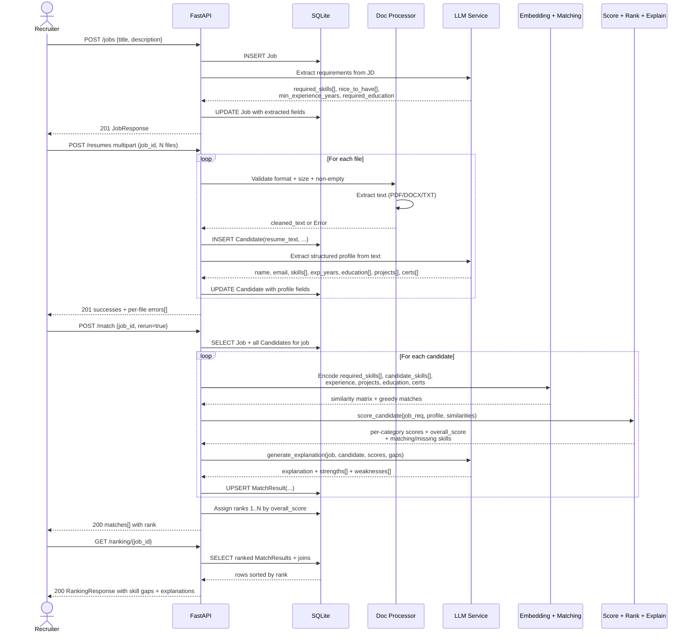

# Architecture Diagram — AI Recruitment Platform

## 1. High-Level (Mermaid)

Render any of the Mermaid blocks below with the Mermaid Live Editor (https://mermaid.live) or a Markdown preview that supports Mermaid.

```mermaid
flowchart TD
    U[Recruiter / User] --> FE[Swagger / ReDoc UI<br>(or future Frontend)]
    FE --> GW[FastAPI HTTP Layer<br>CORS · Validation · JSON errors]

    subgraph API
        GW --> RJ[Routers<br>/jobs · /resumes<br>/match · /ranking · /health]
    end

    subgraph Application Core
        RJ --> ORCH[Recruitment Service<br>orchestrates: extract → embed → score → rank → explain]
        ORCH --> DB[(SQLite<br>via SQLAlchemy ORM<br>Jobs · Candidates · MatchResults)]
        ORCH --> DP[Document Processor<br>PDF · DOCX · TXT · validation]
        ORCH --> LLMSVC[LLM Service<br>1) OpenAI GPT-3.5/4<br>2) Rule-based fallback]
        ORCH --> EMB[Embedding Service<br>1) sentence-transformers (offline)<br>2) OpenAI text-embedding-3-small<br>3) TF-IDF char-ngram fallback]
        ORCH --> SC[Scoring Engine<br>weights: 40/25/20/10/5]
        EMB --> SIM[Cosine Similarity / Greedy Best Match]
        SC --> RANK[Ranker<br>sorts by overall_score → rank]
    end

    LLMSVC -->|Optional network| OAI[(OpenAI API)]
    EMB -->|Optional network| OAI
```

## 2. Detailed End-to-End Flow (Mermaid Sequence)



## 3. Component Responsibilities (ASCII)

```
┌──────────────────────────────────────────────────────────────────────────────┐
│                               FRONTEND / CLIENT                              │
│  (Swagger-UI · ReDoc · curl · future React UI)                               │
└──────────────────────────────────────┬───────────────────────────────────────┘
                                       │ HTTPS + JSON
                                       ▼
┌──────────────────────────────────────────────────────────────────────────────┐
│                            FASTAPI HOST LAYER                                │
│  ┌──────────────────┐  ┌───────────────────┐  ┌──────────────────────────┐   │
│  │  CORS Middleware │  │ Pydantic validation│  │ Error handler registry  │   │
│  └──────────────────┘  └───────────────────┘  └──────────────────────────┘   │
│                                                                              │
│  ROUTERS                                                                     │
│  ┌──────────────┐ ┌──────────────┐ ┌────────────────┐ ┌────────────────┐    │
│  │   /jobs      │ │  /resumes    │ │   /match       │ │ /ranking/{id}  │    │
│  │   /candidates│ │  /health     │ │   /info        │ │ /jobs/{id}/re-x│    │
│  └──────┬───────┘ └──────┬───────┘ └───────┬────────┘ └───────┬────────┘    │
└─────────┼────────────────┼─────────────────┼──────────────────┼─────────────┘
          └────────────────┴───────┬─────────┴──────────────────┘
                                  ▼
                  ┌────────────────────────────────┐
                  │  RECRUITMENT SERVICE           │◄────── Orchestration layer
                  │  extract_and_persist_job(...)  │
                  │  extract_and_persist_cand(...) │
                  │  run_matching_for_job(...)     │
                  │  rank_matches_for_job(...)     │
                  │  get_ranking_for_job(...)      │
                  └──────┬──────────────┬──────────┘
                         │              │
          ┌──────────────┘              └───────────┬──────────────────┐
          ▼                                         ▼                  ▼
  ┌──────────────────┐                     ┌─────────────────┐ ┌──────────────┐
  │  DOCUMENT        │                     │  LLM SERVICE    │ │  EMBEDDING    │
  │  PROCESSOR       │                     │                 │ │  SERVICE      │
  │  pdfplumber      │                     │ • OpenAI client │ │ • sentence-tf │
  │  python-docx     │                     │ • JSON prompts  │ │ • OpenAI embs │
  │  plain text      │                     │ • regex fallback│ │ • TF-IDF fb   │
  │  size + validate │                     │ • explanation   │ │ • cosine sim  │
  └──────────────────┘                     └────────┬────────┘ └──────┬───────┘
                                                    │                  │
                                                    └───────┬──────────┘
                                                            ▼
                   ┌─────────────────────────────────────────────────────┐
                   │              SCORING + RANKING                      │
                   │  ScoringEngine (configurable weights)              │
                   │   Required Skills (40%) · Experience (25%)         │
                   │   Projects (20%) · Edu/Cert (10%) · Nice (5%)     │
                   │  ─────────────────────────────────────────────     │
                   │  score_candidate(...) → overall_score              │
                   │  identify_skill_gaps(...) → matching / missing     │
                   │  rank_candidates(score[]) → rank = 1..N            │
                   └─────────────────────────────────────────────────────┘
                                                            │
                                                            ▼
                  ┌──────────────────────────────────────────────────────┐
                  │                    DATABASE                          │
                  │  SQLAlchemy ORM over SQLite                          │
                  │   Jobs          (id, title, description, reqs…)     │
                  │   Candidates    (id, job_id, profile fields…)       │
                  │   MatchResults  (job_id, cand_id, all scores, rank, │
                  │                   skill_gap, explanation, strengths…│
                  └──────────────────────────────────────────────────────┘
```

## 4. Scoring Pipeline Internals (Mermaid)

```mermaid
flowchart TB
    JR[Job Requirements<br>req_skills[], nice_to_have[],<br>min_exp_years, req_education]
    CP[Candidate Profile<br>skills[], exp_years, exp_summary,<br>education[], projects[], certs[], add_skills[]]

    JR & CP --> E1[Embed skills]
    E1 --> S1[Greedy best-match assignment<br>cosine similarity ≥ 0.68]
    S1 --> P1[Required Skills Score × 0.40]

    JR & CP --> E2[Experience comparator<br>years-ratio + semantic overlap of exp blurb]
    E2 --> P2[Experience Score × 0.25]

    JR & CP --> E3[Projects overlap<br>top-5 projects weighted]
    E3 --> P3[Projects Score × 0.20]

    JR & CP --> E4[Education + Certifications<br>degree ladder + req match + cert relevance]
    E4 --> P4[Education/Cert Score × 0.10]

    JR & CP --> E5[Nice-to-have skills vs additional skills]
    E5 --> P5[Additional Skills Score × 0.05]

    P1 & P2 & P3 & P4 & P5 --> T[Weighted sum → overall_score 0..100]
    T --> G[Skill Gap Analysis<br>matching vs missing vs weak matches]
    T --> R[Ranking: sort DESC by overall_score → rank 1..N]
    T & G --> EXP[LLM Explanation Generator<br>explanation · strengths[] · weaknesses[]]
```
