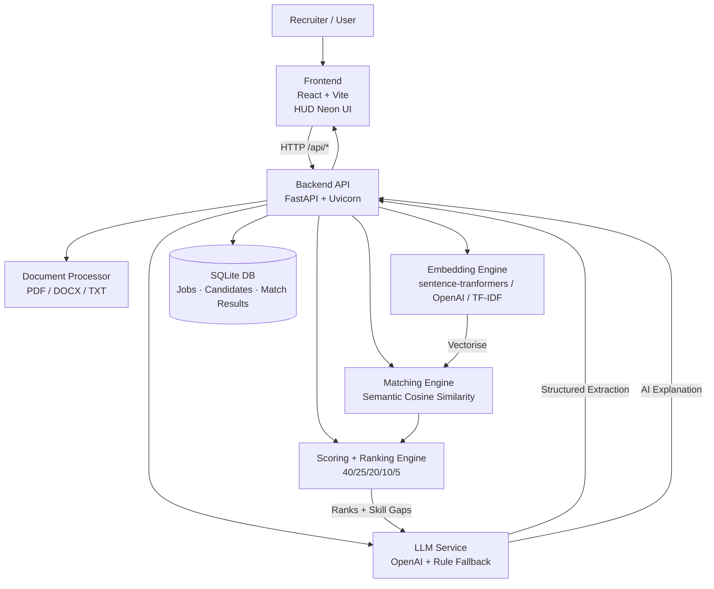

# Architecture Diagram

```mermaid
flowchart TD
    U[Recruiter / User] --> F[Frontend<br/>React + Vite<br/>HUD Neon UI]
    F -->|HTTP /api/*| B[Backend API<br/>FastAPI + Uvicorn]
    B --> DP[Document Processor<br/>PDF / DOCX / TXT]
    B --> L[LLM Service<br/>OpenAI + Rule Fallback]
    B --> E[Embedding Engine<br/>sentence-tranformers / OpenAI / TF-IDF]
    B --> M[Matching Engine<br/>Semantic Cosine Similarity]
    B --> S[Scoring + Ranking Engine<br/>40/25/20/10/5]
    B --> DB[(SQLite DB<br/>Jobs · Candidates · Match Results)]
    L -->|Structured Extraction| B
    E -->|Vectorise| M
    M --> S
    S -->|Ranks + Skill Gaps| L
    L -->|AI Explanation| B
    B --> F
```
